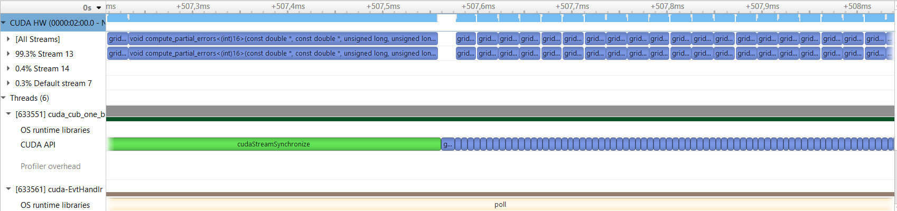
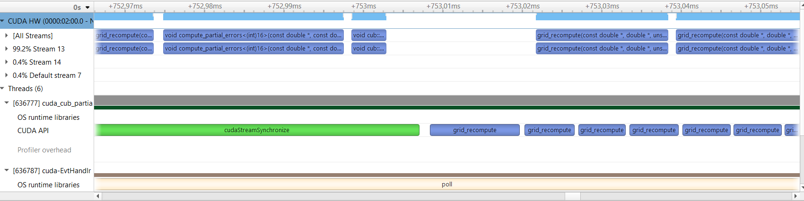
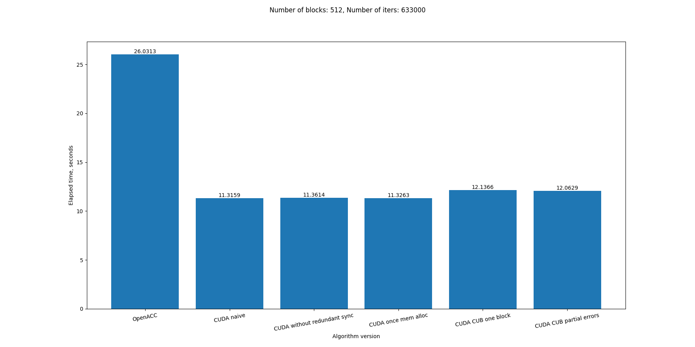
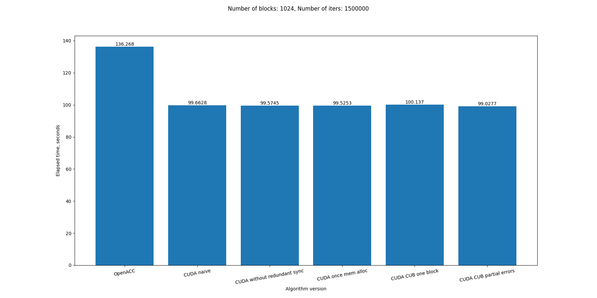

# openacc_heat_equation

## Задание
В данной работе нужно было реализовать уравнение теплопроводности в двумерной области на  равномерных сетках с начальной инициализацией в сетки в граничных точках.

Нужно было реализовать программу на GPU с использованием CUDA, а часть подсчета ошибки реализовать с использованием библиотеки CUB. 

## Ход работы

### <ins>Общие части</ins>

Для удобной реализации уравнения теплопроводности с использованием CUDA на языке C++ были написаны RAII-обертки для аллокаторов памяти на девайсе и хосте, и также для стримов. Эти обертки определены в [данном файле](src/cuda_utils/cuda_utils.cuh). [Аналогичные обертки](src/cuda_utils/cublas_utils.cuh) были написаны для cuBLAS.

### <ins>Версия 1</ins>

[Версия 1](src/heat_equation_solver_cuda_naive.cu) была реализована с учетом знаний, полученных в ходе выполнения предыдущих лабораторных работ: ядра вычислений сетки запускались асинхронно относительно друг друга, были использованы аналогичные шаги для вычисления ошибки **err**.

Как изменилась программа на CUDA в отличие от OpenACC версии:
1. Выделение памяти происходило явно через `cudaMallocPitch` для двумерных массивов, чтобы каждая строка двумерного массива была выровнена для эффективного доступа к ней.
2. Инициализация буфферов сетки и буффера для вычисления ошибки происходило асинхронно в 3-х разных стримах;
3. Для вычисления сетки было написано ядро `grid_recompute`, которое запускалось с количеством нитей в блоке 16x16 и с количеством блоков в сетке (grid_size / 16, grid_size / 16)
4. Ошибка также пересчитывалась с помощью cuBLAS

Ниже приведен профиль наивной версии программы.

Профиль "Версии 1"

По профилю программы можно заметить, что запуски функций из cuBLAS происходят в нулевом стриме, из-за чего происходит слишком ранняя синхронизация стрима.

### <ins>Версия 2</ins>

Во второй версии [программы](src/heat_equation_solver_cuda_without_sync.cu) запуск cuBLAS функций происходил на том же стриме, что и запуск ядер вычисления сетки, из-за чего не было лишнего ожидания лаунчинга cuBLAS-ядер. Явная синхронизация с этим потоком происходила только перед проверкой ошибкой **err**, чтобы определить, нужно ли выходить из цикла. 

Профиль "Версии 2"

По профилю видно, что синхронизация происходила еще раньше, после копирования индекса **err_idx** максимальной разницы текущей и предыдущей сеток с девайса на хост, чтобы использовать его для вычисления ошибки **err**. Также видно, что происходит одно лишнее копирования `DtoD`, а также лишний `cudaFree`.

### <ins>Версия 3</ins>

Далее появилась [идея](src/heat_equation_solver_cuda_once_mem_alloc.cu) избавиться от лишних `DtoD`-копирования и `cudaFree`. Для этого память под ошибку **err** и под индекс ошибки **err_idx** была выделена до начала вычисления сетки, что помогло убрать лишние операции с памятью.

Профиль программы "Версия 3"

### <ins>Версия 4</ins>

В данной [версии](src/heat_equation_solver_cuda_cub_one_block.cu) вместо cuBLAS была использована библиотека CUB для вычисления ошибки **err**. Для этого было написано ядро, которое в одном блоке подсчитывало ошибку **err**

Профиль "Версии 4"

### <ins>Версия 5</ins>

Глядя на результат профилирования версии 4, можно заметить, что ядро вычисления ошибки **err** считается относительно долго. Причина этому - использование одного блока, так как единица вычисления на Streaming Multiprocesser - это warp, из которых в программной модели CUDA состоят блоки. 
Для устранения этого ограничения была написана [программа](src/heat_equation_solver_cuda_cub_partial_errors.cu) с вычислением ошибки **err** в 2 этапа:
1. Вычисление частичных ошибок в ядре `compute_partial_errors`, где каждому блоку сопоставляется ошибка среди индексов сетки, которые попали в блок
2. Вычисление итоговой ошибки из частичных с использованием `cub::DeviceReduce`

Профиль "Версии 5"

## Бенчмарки
В результаты разные оптимизации программы на CUDA не дали особенный прирост в скорости работы программы, но все равно, вариант на CUDA оказался во всех случаях быстрее варианта на OpenACC. Также можно заметить, что самый быстрый вариант из-за сокращенного вычисления ошибки - это "Версия 5", хотя прирост замечается при большом количестве итераций 

Бенчмарки разных версий программ

